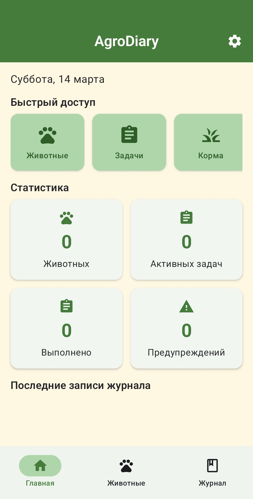
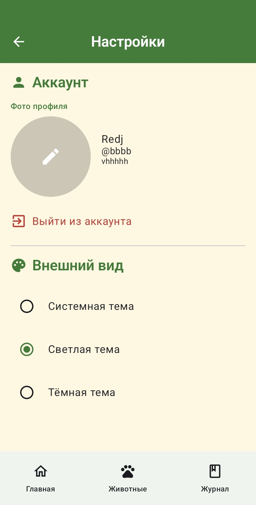
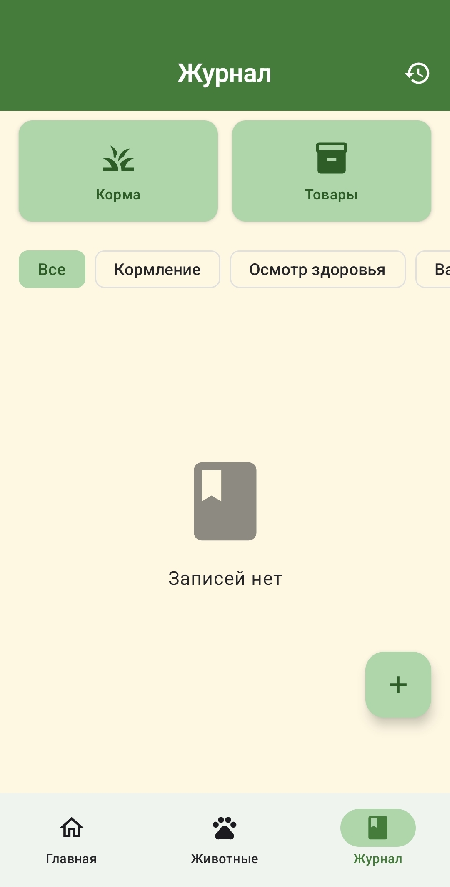

# AgroDiary — Дневник хозяйства для Android


Автономное мобильное приложение для ведения учёта хозяйства: животные, сотрудники, задачи, склады кормов и продуктов, журнал событий и журнал действий. Полностью офлайн, без сетевых зависимостей — все данные хранятся локально на устройстве.

---

## Скриншоты

<p align="center">
  
  
  
</p>

---

## Возможности

| Модуль | Описание |
|--------|----------|
| **Аутентификация** | Регистрация, вход, выход. Пароли хешируются PBKDF2 (65 536 итераций). Сессия — EncryptedSharedPreferences. |
| **Главная (Dashboard)** | Статистика по хозяйству, срочные задачи (≤ 3 дня), предупреждения о низком запасе, быстрый доступ ко всем модулям. |
| **Животные** | CRUD, поиск по имени, фильтр по типу (корова, свинья, курица, овца, коза, другое), фото. |
| **Сотрудники** | CRUD, поиск, фильтр по статусу (активен, уволен, в отпуске), фото. |
| **Задачи** | CRUD, приоритет (LOW/MEDIUM/HIGH/URGENT), статус, срок выполнения, поиск. |
| **Склад кормов** | CRUD складских позиций, индикатор уровня, предупреждения о низком запасе. |
| **Склад продуктов** | CRUD, группировка по категориям (молоко, мясо, яйца, шерсть, другое). |
| **Журнал записей** | CRUD, фильтр по типу записи, быстрые кнопки к складам. |
| **Журнал действий** | Автоматическое логирование создания/обновления/удаления животных и сотрудников. |
| **Отчёты** | Сводные карточки: животные, задачи, запасы, стоимость продуктов. |
| **Настройки** | Профиль, тема (системная/светлая/тёмная), выход из аккаунта. |

---

## Технологический стек

| Компонент | Технология | Версия |
|-----------|------------|--------|
| Язык | Kotlin | 1.9.22 |
| UI | Jetpack Compose + Material 3 | BOM 2024.02.00 |
| Архитектура | MVVM + Clean Architecture | — |
| БД | Room (SQLite) | 2.6.1 |
| DI | Hilt | 2.50 |
| Навигация | Navigation Compose | 2.7.7 |
| Изображения | Coil | 2.5.0 |
| Безопасность | AndroidX Security Crypto | 1.0.0 |
| Корутины | Kotlinx Coroutines | 1.7.3 |
| Lifecycle | ViewModel + Flow | 2.7.0 |
| Build | AGP / KSP | 8.2.0 / 1.9.22 |

---

## Требования

- **Для пользователей:** Android 8.0+ (API 26)
- **Для разработчиков:** Android Studio Hedgehog+, JDK 17

---

## Установка

### Из APK

1. Скачайте APK из [Releases](https://github.com/SilaVoin/AgroDiary/releases).
2. Скопируйте на устройство и откройте файл.
3. Разрешите установку из неизвестных источников (при необходимости).

### Сборка из исходников

```bash
git clone https://github.com/SilaVoin/AgroDiary.git
cd AgroDiary

# Сборка проекта
./gradlew build

# Unit-тесты
./gradlew test

# Debug APK
./gradlew assembleDebug

# Release APK
./gradlew assembleRelease
```

APK: `app/build/outputs/apk/release/app-release.apk`

---

## Архитектура

```
UI (Composable) → ViewModel → Repository → DAO / Room → Flow → UI
```

- **UI слой** — Compose-экраны (~25 шт.), 13 переиспользуемых компонентов. Состояние через `collectAsStateWithLifecycle()`.
- **ViewModel слой** — 11 ViewModel, управление uiState (loading/error/success), валидация, вызовы репозиториев.
- **Repository слой** — 10 репозиториев, обёртка над DAO, автоматические таймстемпы, журнал действий.
- **Data слой** — 10 DAO, 11 сущностей, 10 enum/type-классов, Room DB v3 с явными миграциями.

### DI-граф (Hilt)

- `DatabaseModule` — AppDatabase + 10 DAO
- `RepositoryModule` — 10 репозиториев

### Навигация

3 нижних вкладки (Главная, Животные, Журнал) и 30+ маршрутов. Стартовый маршрут — экран входа с автопереходом на Dashboard при активной сессии.

---

## Структура проекта

```
app/src/main/java/com/agrodiary/
├── data/
│   ├── local/
│   │   ├── dao/              # 10 DAO-интерфейсов
│   │   ├── entity/           # 11 сущностей + 10 enum
│   │   ├── converter/        # TypeConverters (Date, Enum)
│   │   └── AppDatabase.kt    # Room DB v3, миграции
│   └── repository/           # 10 репозиториев
├── di/                       # DatabaseModule, RepositoryModule
├── ui/
│   ├── theme/                # Color, Type, Shape, Theme
│   ├── components/           # 13 переиспользуемых компонентов
│   ├── navigation/           # NavGraph, Screen, BottomNavBar
│   ├── home/                 # Dashboard
│   ├── animals/              # CRUD животных
│   ├── staff/                # CRUD сотрудников
│   ├── tasks/                # CRUD задач
│   ├── journal/              # Журнал записей
│   ├── feed/                 # Склад кормов
│   ├── products/             # Склад продуктов
│   ├── reports/              # Отчёты
│   ├── settings/             # Настройки
│   └── auth/                 # Аутентификация
├── common/                   # ValidationUtils, PermissionUtils
└── AgroDiaryApp.kt           # @HiltAndroidApp
```

---

## База данных

**Room v3** — 10 таблиц: `users`, `animals`, `staff`, `tasks`, `journal_entries`, `feed_stocks`, `feed_transactions`, `products`, `product_transactions`, `activity_logs`.

### Миграции
- **v1 → v2** — таблица `users` (аутентификация)
- **v2 → v3** — поле `passwordSalt` в users; таблица `activity_logs`

Схемы экспортируются в `app/schemas/`.

---

## Безопасность

- **Пароли:** PBKDF2WithHmacSHA256, 65 536 итераций, 256-бит ключ, 16-байт соль (SecureRandom).
- **Сессия:** EncryptedSharedPreferences (AES-256-SIV ключи, AES-256-GCM значения).
- **Legacy:** автоматический апгрейд SHA-256 → PBKDF2 при входе.
- **Офлайн:** нет сетевых запросов, нет интернет-разрешений.
- **Приватность:** нет телеметрии, аналитики или облачной передачи данных.

---

## Статистика кодовой базы

| Метрика | Значение |
|---------|----------|
| Исходных файлов (.kt) | ~121 |
| Таблиц БД | 10 |
| DAO | 10 |
| Репозиториев | 10 |
| ViewModel | 11 |
| Экранов | ~25 |
| Компонентов UI | 13 |
| Enum/type классов | 10 |
| Миграций БД | 2 |

---

## Известные ограничения

- Offline-only — нет синхронизации и облачных бэкапов.
- Транзакции кормов/продуктов — маршруты объявлены, экраны-заглушки.
- Смена пароля (`changePassword`) реализована в backend, но не вызывается из UI.
- R8/ProGuard отключён; release подписывается debug-ключом.
- «Уведомления» и «Резервное копирование» в Настройках — заглушки.

---

## Лицензия

MIT
